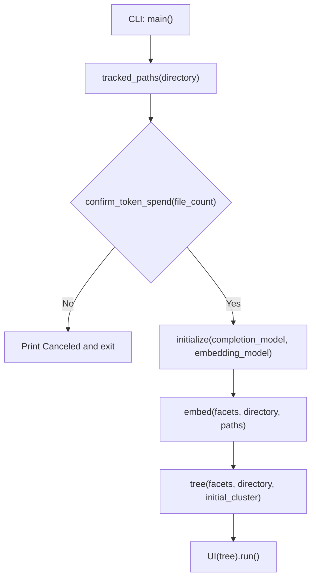
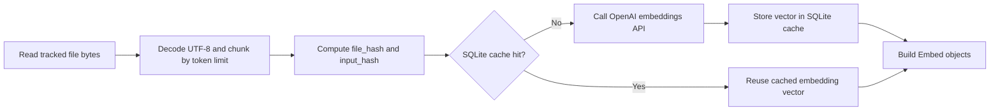
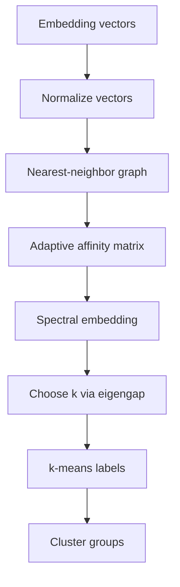

# Semantic Navigator Walkthrough

This document explains how the code works at a high level.

## What The Tool Does

`semantic-navigator` scans tracked files in a Git repository, turns file contents into embeddings, clusters similar files, asks an LLM to label files/clusters, and renders a navigable tree UI.

## Main Entry Point

Most of the behavior lives in `semantic_navigator/main.py`.

Key steps from `main()`:

1. Parse CLI arguments (`repository`, `--completion-model`, `--embedding-model`).
2. Discover tracked files with `tracked_paths()`.
3. Confirm token spend with `confirm_token_spend()` for large repos.
4. Initialize OpenAI clients/tokenizers with `initialize()`.
5. Build embeddings with `embed()`.
6. Build labeled hierarchy with `tree()` and `label_nodes()`.
7. Render UI with `UI(...).run()`.

## End-To-End Flow

## Embedding Pipeline And Cache

During `embed()` the code reads files asynchronously, builds token-limited chunks, and gets embeddings from OpenAI.

The recent caching feature adds a SQLite cache under XDG cache paths:

- `$XDG_CACHE_HOME/semantic-navigator/cache.sqlite3`
- Fallback: `~/.cache/semantic-navigator/cache.sqlite3`

For each chunk:

- `file_hash` is SHA-256 of raw file bytes.
- `input_hash` is SHA-256 of the exact embedding input text.
- Cache lookup uses `(embedding_model, input_hash, schema_version)`.

## Clustering Strategy

`cluster()` converts embeddings into a similarity graph, then applies spectral clustering + k-means.

High-level behavior:

1. Normalize embedding vectors.
2. Build nearest-neighbor graph with cosine distance.
3. Build adaptive affinity matrix.
4. Compute spectral embedding from graph Laplacian.
5. Pick cluster count via eigengap heuristic.
6. Run k-means over spectral embedding.

## Labeling And Tree Construction

`label_nodes()` is recursive:

- If a cluster is a leaf, it asks the completion model to label each file.
- If not a leaf, it recursively labels children, then asks the model for cluster labels.

`tree()` wraps this into a top-level `Tree` structure consumed by the Textual UI.

## UI Rendering

The `UI` class uses Textual's tree widget:

- Root node is the repository path.
- Internal nodes are labeled clusters with file counts.
- Leaf nodes are individual file labels.

This gives an interactive hierarchy where semantically related files are grouped together.

## Important Data Types

- `Facets`: shared clients/models/encodings.
- `EmbedInput`: prepared text chunk plus hashes for caching.
- `Embed`: final embedding unit (path, content, vector).
- `Cluster`: a list of embeds.
- `Tree`: labeled hierarchical output for UI.

## Error Handling And Graceful Fallbacks

The pipeline intentionally skips problematic files during read:

- Non-UTF-8 files
- Missing files
- Directory/submodule edge cases
- Permission errors

For caching, SQLite setup failures fall back to non-cached embedding behavior so a run can still complete.

## Mental Model

If you remember only one thing: the tool is a pipeline from **tracked files -> embeddings -> clusters -> labels -> interactive tree UI**, with caching to avoid re-embedding unchanged content.
